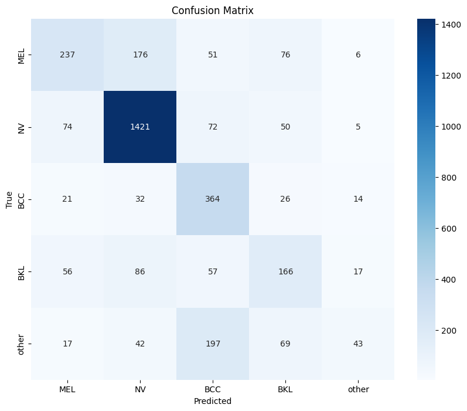
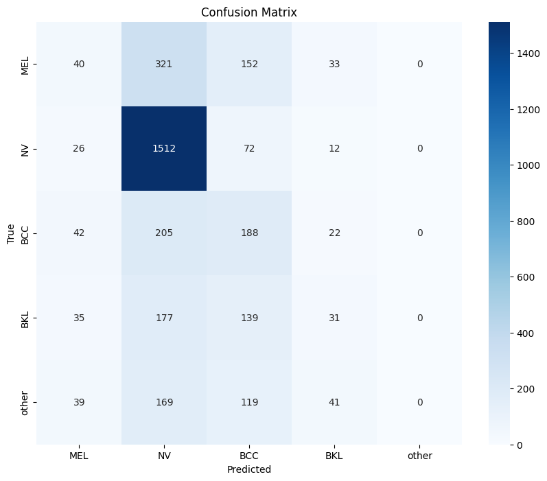
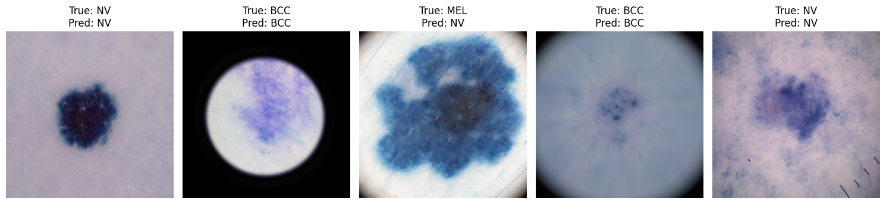

# Skin Disease Diagnosis Using Computer Vision

Developed and evaluated deep learning models (CNN without metadata and EfficientNetB0) to classify skin lesions from dermatoscopic images using the ISIC 2019 dataset. Investigated the impact of including patient metadata (age, sex, lesion location) on classification accuracy. Applied data preprocessing, class balancing, image augmentation, and performance tuning techniques — all within the AI4ALL Ignite program.

## Problem Statement <!--- do not change this line -->

Skin cancer is one of the most common cancers worldwide, and early detection is critical for effective treatment — especially for melanoma, the deadliest form. However, accurate diagnosis requires expert dermatologists and high-resolution dermatoscopic imaging, which are not always available, especially in under-resourced areas.

This project explores how deep learning models can assist in classifying skin lesions using dermatoscopic images, helping to improve diagnostic speed, consistency, and accessibility. By evaluating multiple models and integrating patient metadata, we aim to enhance diagnostic accuracy and reduce missed melanoma cases — with the potential to support global healthcare delivery.

## Key Results <!--- do not change this line -->

1. Developed and trained two deep learning models using the ISIC 2019 dermatoscopic image dataset:
   - A baseline CNN model without metadata
   - An EfficientNetB0 model with metadata (age, sex, lesion location)
2. EfficientNetB0 achieved 66% accuracy and a weighted F1-score of 0.64 across five classes: MEL, NV, BCC, BKL, and other.
3. Key findings:
   - EfficientNetB0 significantly outperformed CNN, especially for melanoma detection (F1-score: 0.50 vs. 0.11).
   - CNN struggled with class imbalance, showing low recall on minority classes like melanoma.
   - Incorporating patient metadata in EfficientNetB0 showed improved classification stability and sensitivity.
4. Used model optimization strategies such as freezing base layers, reducing learning rate, and early stopping to prevent overfitting.
5.  Identified class imbalance as a key source of bias affecting model performance.

## Classification Reports & Confusion Matrices

Evaluation of both models — a baseline CNN and an EfficientNetB0 model with metadata — on a 5-class subset of the ISIC 2019 dataset: **MEL, NV, BCC, BKL, Other**.

### EfficientNetB0 + Metadata

**Classification Report**

| Class  | Precision | Recall | F1-Score | Support |
|--------|-----------|--------|----------|---------|
| MEL    | 0.59      | 0.43   | 0.50     | 546     |
| NV     | 0.81      | 0.88   | 0.84     | 1622    |
| BCC    | 0.49      | 0.80   | 0.61     | 457     |
| BKL    | 0.43      | 0.43   | 0.43     | 382     |
| Other  | 0.51      | 0.12   | 0.19     | 368     |
| **Accuracy** |       –     |    –    | **0.66** | **3375** |
| **Macro avg** | 0.56 | 0.53 | 0.51 | – |
| **Weighted avg** | 0.65 | 0.66 | 0.64 | – |

**Confusion Matrix**

---

### Baseline CNN (No Metadata)

**Classification Report**

| Class  | Precision | Recall | F1-Score | Support |
|--------|-----------|--------|----------|---------|
| MEL    | 0.22      | 0.07   | 0.11     | 546     |
| NV     | 0.63      | 0.93   | 0.75     | 1622    |
| BCC    | 0.28      | 0.41   | 0.33     | 457     |
| BKL    | 0.22      | 0.08   | 0.12     | 382     |
| Other  | 0.00      | 0.00   | 0.00     | 368     |
| **Accuracy** |       –     |    –    | **0.52** | **3375** |
| **Macro avg** | 0.27 | 0.30 | 0.26 | – |
| **Weighted avg** | 0.40 | 0.52 | 0.44 | – |

**Confusion Matrix**

---

### Observations

- **EfficientNetB0** significantly outperformed **CNN**, especially on **MEL** and **BCC**.
- CNN showed very poor performance on minority classes like **MEL** and **Other**.
- Incorporating metadata (age, sex, lesion site) helped increase stability and sensitivity, especially for difficult classes.
- Confusion is still observed between visually similar classes, especially **MEL** ↔ **BKL** and **Other**.

## Example Predictions of EfficientNetB0

### Correct Predictions

## Methodologies <!--- do not change this line -->

To build and evaluate skin lesion classification models, I used Python with TensorFlow and Keras frameworks. The ISIC 2019 dataset was preprocessed using pandas and NumPy, while image loading and scaling were handled via ImageDataGenerator.

Two main models were developed and trained:
- Baseline CNN: a custom convolutional neural network consisting of three convolutional layers with ReLU activations, followed by max-pooling, flattening, and dense layers. The final layer uses softmax activation to classify images into five skin lesion categories.
- EfficientNetB0: a pretrained EfficientNetB0 model extended to include metadata inputs (age, sex, lesion location) alongside image data. Class labels were encoded using multi-label one-hot encoding.

Model evaluation was performed using metrics such as accuracy, precision, recall, F1-score, and confusion matrices.

To enhance EfficientNetB0 performance and mitigate overfitting, the following techniques were applied:
- Freezing pretrained base layers during initial training stages
- Reducing learning rate during fine-tuning
- Early stopping with weight restoration
## Data Sources <!--- do not change this line -->

This project utilized the following datasets and reference studies:

- Kaggle Dataset: [ISIC 2019: Skin Lesion Analysis Towards Melanoma Detection](https://www.kaggle.com/datasets/andrewmvd/isic-2019/data)
- International Skin Imaging Collaboration (ISIC). (2019). *ISIC 2019: Skin lesion analysis towards melanoma detection.* [https://challenge.isic-archive.com/landing/2019](https://challenge.isic-archive.com/landing/2019)
- National Cancer Institute, Surveillance, Epidemiology, and End Results Program (SEER). (2025). *Cancer stat facts: Melanoma of the skin.* [https://seer.cancer.gov/statfacts/html/melan.html](https://seer.cancer.gov/statfacts/html/melan.html)
- Tschandl, P., Rosendahl, C., & Kittler, H. (2018). *The HAM10000 dataset, a large collection of multi-source dermatoscopic images of common pigmented skin lesions.* Scientific Data, 5, 180161. https://doi.org/10.1038/sdata.2018.161
- Esteva, A., Kuprel, B., Novoa, R. A., Ko, J., Swetter, S. M., Blau, H. M., & Thrun, S. (2017). *Dermatologist-level classification of skin cancer with deep neural networks.* Nature, 542(7639), 115–118. https://doi.org/10.1038/nature21056
- Brinker, T. J., Hekler, A., Enk, A. H., Berking, C., Haferkamp, S., Hauschild, A., ... & von Kalle, C. (2019). *Deep learning outperformed 136 of 157 dermatologists in a head-to-head dermoscopic melanoma image classification task.* European Journal of Cancer, 113, 47-54. https://doi.org/10.1016/j.ejca.2019.04.001
- Codella, N. C. F., Rotemberg, V., Tschandl, P., Celebi, M. E., Dusza, S. W., Gutman, D., ... & Halpern, A. (2018). *Skin lesion analysis toward melanoma detection: A challenge at the 2017 International Symposium on Biomedical Imaging (ISBI), hosted by the International Skin Imaging Collaboration (ISIC).* arXiv preprint arXiv:1805.01275. [https://arxiv.org/abs/1805.01275](https://arxiv.org/abs/1805.01275)

## Technologies Used <!--- do not change this line -->

This project utilizes the following technologies, libraries, and frameworks:

- Python  
- TensorFlow  
- Keras  
- pandas  
- NumPy  
- scikit-learn  
- Matplotlib  
- Seaborn  
- OpenCV  
- Jupyter Notebook  
- ImageDataGenerator (from TensorFlow/Keras)

## Authors <!--- do not change this line -->

*This project was completed by:*
- Alisa Teige ([alisateige@gmail.com](mailto:alisateige@gmail.com))

